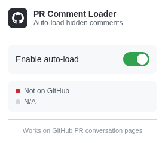
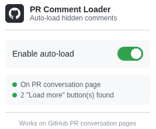

# GitHub PR Comment Loader

When enter to GitHub PR website page with many comments, GitHub hides older comments behind "Load more..." buttons. This makes it difficult to see all unresolved review comments without manually clicking multiple buttons.

Tired of clicking "Load more" button? This extension automatically clicks all "Load more..." buttons on PR conversation pages, ensuring you can see all comments immediately.

## User Guide

After install chrome extension, you will get

And if you enter to GitHub Pull Request page like `github.com/repo/pull/number`, and there is enough comments to generate "Load more" button, this extension automatically click that "Load more" button. You will get unhidden comments without any effort!

